# Kontext 命令执行流程分析报告

> 生成日期：2026-03-25

本文档详细描述 Kontext CLI 中每个命令（`init`、`pack`、`validate`、`update`、`config`）的完整执行流程，包含流程描述、核心代码路径和 Mermaid 流程图。

---

## 目录

- [1. 全局入口与公共前置](#1-全局入口与公共前置)
- [2. init 命令](#2-init-命令)
  - [2.1 交互式初始化 (默认)](#21-交互式初始化-默认)
  - [2.2 AI 交互式初始化](#22-ai-交互式初始化)
  - [2.3 静态模板初始化](#23-静态模板初始化)
  - [2.4 Scan 自动扫描初始化](#24-scan-自动扫描初始化)
- [3. pack 命令](#3-pack-命令)
- [4. validate 命令](#4-validate-命令)
- [5. update 命令](#5-update-命令)
- [6. config 命令](#6-config-命令)

---

## 1. 全局入口与公共前置

### 入口链路

```
main.go → cmd.Execute() → rootCmd.Execute() → PersistentPreRunE → 子命令 RunE
```

### PersistentPreRunE（所有命令的前置钩子）

每个子命令执行前，根命令的 `PersistentPreRunE` 会自动运行：

1. 读取 `--log-level` 和 `--log-format` 参数（或对应环境变量 `KONTEXT_LOG_LEVEL`、`KONTEXT_LOG_FORMAT`）
2. 调用 `logging.Init()` 初始化结构化日志系统
3. 跳过 `help`、`__complete` 等非业务命令的生命周期日志
4. 记录 `command started` 日志（包含命令路径、参数数量、日志文件路径）

**核心文件：** `cmd/root.go:35-69`

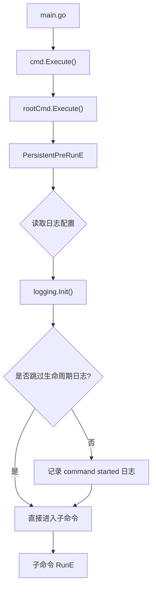

---

## 2. init 命令

`init` 命令负责初始化 `.kontext/` 目录，支持三种模式：交互式（默认）、静态模板、Scan 自动扫描。

**核心文件：** `cmd/init.go`、`cmd/init_interactive.go`、`cmd/init_scan.go`、`cmd/init_helpers.go`、`cmd/init_templates.go`

### 模式选择流程

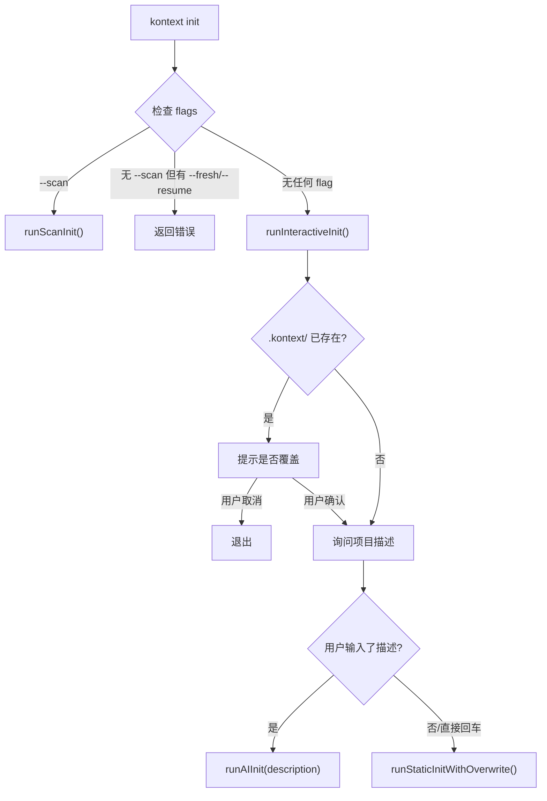

### 2.1 交互式初始化 (默认)

**入口：** `runInteractiveInit()` — `cmd/init_interactive.go:17`

**流程描述：**

1. 检查 `.kontext/` 目录是否已存在，若存在则提示用户是否覆盖
2. 提示用户输入项目描述
3. 若用户输入了描述 → 进入 AI 初始化流程
4. 若用户直接回车 → 进入静态模板初始化

### 2.2 AI 交互式初始化

**入口：** `runAIInit(description)` — `cmd/init_interactive.go:71`

**流程描述：**

1. 加载 LLM 配置（`config.Load()`）
2. 校验 API Key 是否存在
3. 创建 LLM 客户端
4. 调用 `generator.RunInteractiveInit(client, description)` 执行两阶段生成：
   - **阶段 1 — 多轮对话澄清需求**（`runInterview`）：
     - 使用 `InitInterviewSystem` / `InitInterviewUser` 模板构建初始消息
     - 最多进行 10 轮 Q&A，每轮 LLM 返回结构化 JSON（`InterviewResponse`）
     - LLM 可返回 `type: "question"`（继续提问）或 `type: "done"`（结束并输出摘要）
     - 用户可选择预设选项或自定义输入
   - **阶段 2 — 生成 YAML 配置**（`generateAndWrite`）：
     - 使用 `InitGenerateSystem` / `InitGenerateUser` 模板，传入需求摘要和对话记录
     - 调用 `GenerateStructuredYAML()` 生成 `GeneratedYAML` 结构体
     - 优先使用 JSON Schema 结构化输出，失败回退到传统 JSON 解析
     - 调用 `WriteGeneratedYAML()` 校验并写入文件

**核心文件：** `internal/generator/engine.go:27-207`

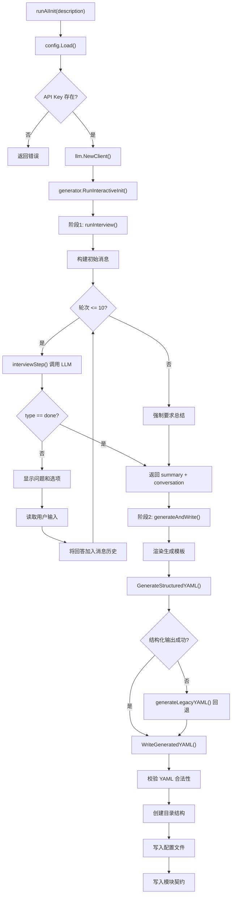

### 2.3 静态模板初始化

**入口：** `runStaticInitWithOverwrite()` — `cmd/init_interactive.go:131`

**流程描述：**

1. 创建目录结构：`.kontext/`、`.kontext/module_contracts/`、`.kontext/prompts/`
2. 写入三个核心模板文件：
   - `PROJECT_MANIFEST.yaml`（默认项目清单模板）
   - `ARCHITECTURE_MAP.yaml`（默认架构图模板）
   - `CONVENTIONS.yaml`（默认编码规范模板）
3. 写入示例模块契约 `example_CONTRACT.yaml`
4. 输出后续步骤提示

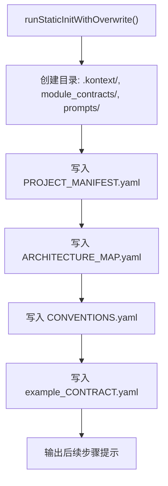

### 2.4 Scan 自动扫描初始化

**入口：** `runScanInit()` — `cmd/init_scan.go:52`

这是最复杂的初始化模式，包含 **9 个阶段**的流水线，支持检查点缓存和断点恢复。

#### 2.4.1 缓存与恢复逻辑

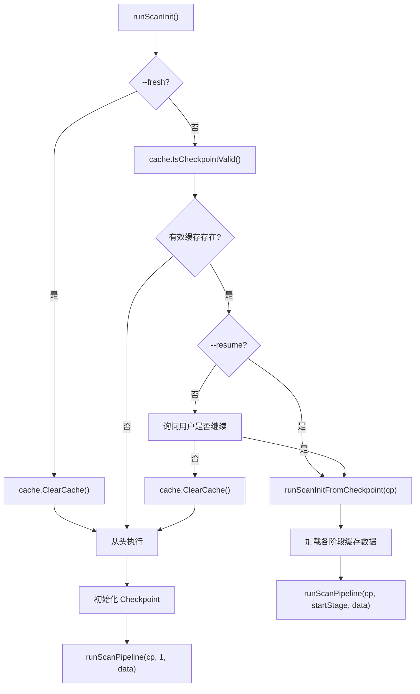

#### 2.4.2 九阶段流水线详解

**前置：** 加载 LLM 配置，创建客户端。

| 阶段 | 名称 | 描述 | 是否需要 LLM |
|------|------|------|-------------|
| 1 | 扫描目录树 | `fileutil.ScanDirectoryTree()` 扫描项目文件 | 否 |
| 2 | AI 分析关键文件 | LLM 分析目录结构，识别配置文件和核心源码 | 是 |
| 3 | 读取配置文件 | 读取阶段 2 识别的配置/依赖文件内容 | 否 |
| 4 | 提取源码概要 | `fileutil.ExtractFileSummary()` 提取函数签名等 | 否 |
| 5 | AI 选择重点文件 | LLM 根据概要选择最重要的文件深入分析 | 是 |
| 6 | 生成项目清单 | LLM 生成 `PROJECT_MANIFEST.yaml` | 是 |
| 7 | 并行生成架构与规范 | LLM 并行生成 `ARCHITECTURE_MAP.yaml` + `CONVENTIONS.yaml` | 是 |
| 8 | 生成依赖关系图 | LLM 分析模块间依赖关系 | 是 |
| 9 | 并行生成模块契约 | LLM 并行生成各模块的 `*_CONTRACT.yaml`，含流式输出和自动重试 | 是 |

**每个阶段完成后，都会保存缓存并更新检查点。**

```mermaid
flowchart TD
    A["runScanPipeline()"] --> B["加载 LLM 配置"]
    B --> C["创建 LLM 客户端"]

    C --> S1["阶段1: 扫描目录树"]
    S1 -->|"fileutil.ScanDirectoryTree()"| S1R["发现 N 个文件"]
    S1R --> S1C["缓存阶段1结果"]

    S1C --> S2["阶段2: AI 分析关键文件"]
    S2 -->|LLM| S2A["generator.AnalyzeProjectFiles()"]
    S2A --> S2F{LLM 成功?}
    S2F -->|是| S2R["识别配置文件 + 核心源码"]
    S2F -->|否| S2B["localAnalyzeFiles() 本地回退"]
    S2B --> S2R
    S2R --> S2C["缓存阶段2结果"]

    S2C --> S3["阶段3: 读取配置文件"]
    S3 --> S3R["读取配置文件内容到 map"]
    S3R --> S3C["缓存阶段3结果"]

    S3C --> S4["阶段4: 提取源码概要"]
    S4 -->|"fileutil.ExtractFileSummary()"| S4R["提取函数签名、类型定义等"]
    S4R --> S4C["缓存阶段4结果"]

    S4C --> S5["阶段5: AI 选择重点文件"]
    S5 -->|LLM| S5A["generator.SelectKeyFiles()"]
    S5A --> S5F{LLM 成功?}
    S5F -->|是| S5R["选择重点文件列表"]
    S5F -->|否| S5B["回退: 取前10个源码文件"]
    S5B --> S5R
    S5R --> S5D["读取重点文件内容(前200行)"]
    S5D --> S5C["缓存阶段5结果"]

    S5C --> S6["构建派生数据(目录树/baseUserMsg)"]
    S6 --> S6A["executeScanStages6to9()"]

    S6A --> S7["阶段6: 生成 PROJECT_MANIFEST.yaml"]
    S7 -->|LLM| S7A["generator.GenerateSingleYAML()"]
    S7A --> S7V["校验 YAML + 写入文件"]
    S7V --> S7C["缓存阶段6结果"]

    S7C --> S8["阶段7: 并行生成架构与规范"]
    S8 --> S8A["goroutine: ARCHITECTURE_MAP.yaml"]
    S8 --> S8B["goroutine: CONVENTIONS.yaml"]
    S8A --> S8W["等待两者完成"]
    S8B --> S8W
    S8W --> S8V["校验 YAML + 写入文件"]
    S8V --> S8C["缓存阶段7结果"]

    S8C --> S9["阶段8: 生成依赖关系图"]
    S9 --> S9M{有模块?}
    S9M -->|否| S9S["跳过"]
    S9M -->|是| S9A["generator.GenerateDependencyGraph()"]
    S9A --> S9C["缓存阶段8结果"]
    S9S --> S9C

    S9C --> S10["阶段9: 并行生成模块契约"]
    S10 --> S10M{有模块?}
    S10M -->|否| S10S["跳过"]
    S10M -->|是| S10A["generator.GenerateModuleContracts()"]
    S10A --> S10P["并发限制(3), 流式输出, 实时写入 .partial"]
    S10P --> S10F{有失败的模块?}
    S10F -->|是| S10R["自动重试失败模块"]
    S10F -->|否| S10D["完成"]
    S10R --> S10D
    S10S --> S10D

    S10D --> DONE["输出完成信息"]
```

#### 2.4.3 模块发现逻辑

模块列表的确定优先从 `ARCHITECTURE_MAP.yaml` 的 `layers.packages` 中解析，解析失败时回退到目录规则扫描（识别 `internal/`、`cmd/`、`pkg/`、`templates/` 下的子目录）。

**核心文件：** `cmd/init_scan.go:993-1073`

---

## 3. pack 命令

`pack` 命令将项目上下文打包为结构化 Markdown Prompt 文档，供大模型直接消费。

**核心文件：** `cmd/pack.go`、`internal/packer/engine.go`

### 3.1 任务输入解析

支持三种输入方式：
- **位置参数**：`kontext pack "任务描述"`
- **文件输入**：`kontext pack -f task.txt` 或 `kontext pack -f -`（stdin）
- **交互式输入**：无参数时提示用户逐行输入，空行结束

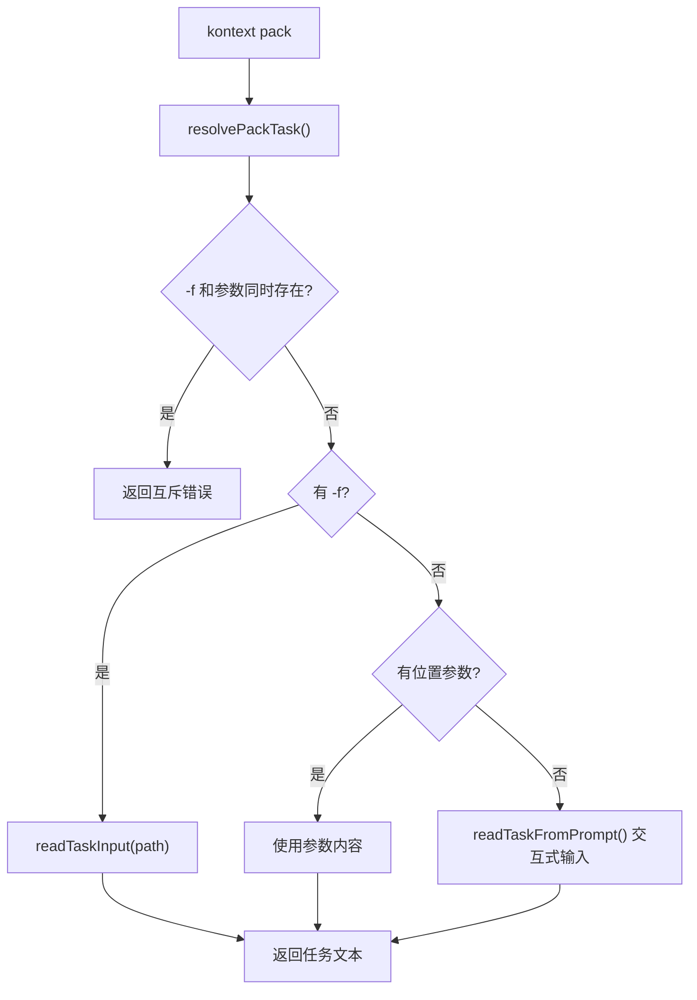

### 3.2 十阶段 Pack 流水线

**入口：** `engine.Pack(task)` — `internal/packer/engine.go:37`

| 阶段 | 名称 | 描述 | 关键函数 |
|------|------|------|---------|
| 1 | 加载配置 | 从 `.kontext/` 加载 Bundle（Manifest + Architecture + Conventions + Contracts） | `schema.LoadBundle()` |
| 2 | 扫描候选文件 | 扫描项目目录树生成候选文件列表 | `ScanCandidateFiles()` |
| 3 | LLM 识别文件 | 调用 LLM 识别与任务相关的文件，支持批量处理和重试 | `IdentifyRelevantFiles()` |
| 4 | 收集候选上下文 | 收集目录树、匹配文件摘要、模块契约；预加载识别文件内容 | `CollectContext()` + `PreloadIdentifiedFiles()` |
| 5 | LLM 精筛 | 对候选文件做二次精筛，按 high/medium 分级（可通过 `--no-refine` 跳过） | `RefineContext()` |
| 6 | 整理上下文 | 根据精筛结果选择最终文件，过滤模块契约 | `HydrateContext()` |
| 7 | 构建模板数据 | 将 Bundle + CandidateContext 转换为 TemplateData | `BuildTemplateData()` |
| 8 | LLM 生成文档 | 渲染系统/用户提示词，流式调用 LLM 生成 Markdown Prompt | `RenderSystemPrompt()` + `RenderUserPrompt()` + `ChatStreamWithRetry()` |
| 9 | 生成文件名 | 调用 LLM 生成语义化文件名 | `GenerateFilenameSuggestion()` |
| 10 | 保存文件 | 保存到 `--output` 指定路径或 `.kontext/prompts/` | `promptdoc.SavePrompt()` |

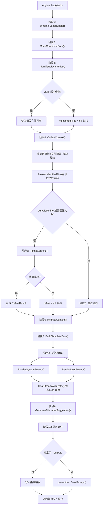

### 3.3 文件识别详细流程

`IdentifyRelevantFiles()` 支持批量处理大文件列表：

1. 将候选文件按 `maxIdentifyCandidateBatchSize` 分批
2. 每批调用 LLM 结构化输出，返回 `MentionedFiles`（路径 + 理由）
3. 合并所有批次结果，去重，限制最大文件数
4. 校验返回路径：必须在候选列表中 + 文件实际存在

### 3.4 精筛详细流程

`RefineContext()` 接收候选文件（路径 + 摘要）、模块契约、已识别文件内容：

1. 渲染精筛提示词模板
2. 调用 LLM 结构化输出，返回 `RefineResult`（每个文件标记 `high`/`medium`/`low`）
3. 过滤掉 `low` 相关度的文件
4. 按相关度排序（`high` 优先），限制最大文件数

---

## 4. validate 命令

`validate` 是最简单的命令，校验 `.kontext/` 目录下所有 YAML 配置文件。

**核心文件：** `cmd/validate.go`、`internal/schema/loader.go:80-153`

### 流程描述

1. 调用 `schema.ValidateBundle(kontextDir)` 校验所有配置
2. 校验项 `PROJECT_MANIFEST.yaml`（必须存在，`project.name` 必填）
3. 校验项 `ARCHITECTURE_MAP.yaml`（可选，存在则必须可解析）
4. 校验项 `CONVENTIONS.yaml`（可选，存在则必须可解析）
5. 校验项 `module_contracts/*.yaml`（可选，每个文件必须可解析）
6. 收集所有错误并输出

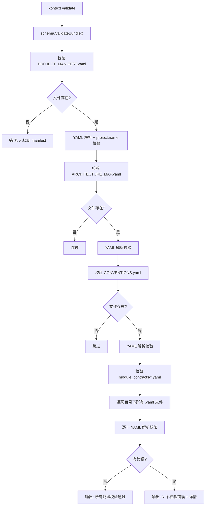

---

## 5. update 命令

`update` 命令检测代码变更并自动更新 `.kontext/` 物料，支持 `--dry-run`、`--file` 过滤和 `--since` 指定 git commit。

**核心文件：** `cmd/update.go`、`internal/updater/detector.go`、`internal/updater/planner.go`、`internal/updater/executor.go`

### 5.1 整体流程

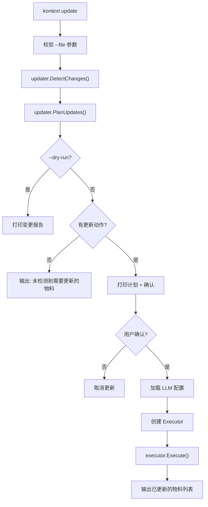

### 5.2 变更检测（DetectChanges）

**入口：** `updater.DetectChanges()` — `internal/updater/detector.go:18`

检测维度：

1. **目录结构变更**：对比实际包路径与 `ARCHITECTURE_MAP.yaml` 中记录的包路径
   - 新增包（代码存在但 ARCHITECTURE_MAP 未记录）
   - 删除包（ARCHITECTURE_MAP 记录但代码已不存在）
2. **模块契约变更**：
   - 新模块（代码中存在但缺少契约文件）
   - 过期契约（通过 `owns` 条目和导出符号比对）
   - 已删模块（契约存在但代码中找不到）
3. **Manifest 信号**：
   - 基于 `--since` 的 git diff 分析关键文件变更（go.mod, package.json 等）
   - 语言检测不匹配（如存在 go.mod 但 manifest 未提及 Go）

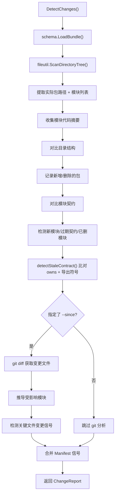

### 5.3 更新规划（PlanUpdates）

**入口：** `updater.PlanUpdates()` — `internal/updater/planner.go:9`

根据 ChangeReport 生成按优先级排序的更新动作：

| 优先级 | 目标 | 触发条件 |
|-------|------|---------|
| 1 | `architecture` | 存在目录结构变更 |
| 2 | `contract:<模块名>` | 对应模块有契约变更 |
| 3 | `manifest` | ManifestLikelyStale 或用户显式请求 |

`--file` 参数可过滤特定目标：`manifest`、`architecture`、`contracts`、`all`。

### 5.4 执行更新（Execute）

**入口：** `executor.Execute()` — `internal/updater/executor.go:61`

执行逻辑：

1. 遍历更新动作列表
2. **契约更新批量并行执行**（最大并发数 4）
3. 其他更新（architecture、manifest）顺序执行
4. 每个更新动作：
   - 读取当前文件内容
   - 渲染对应的更新模板（`UpdateArchitecture`/`UpdateManifest`/`UpdateContract`）
   - 调用 LLM 生成新内容（结构化输出 + 回退机制 + 语义校验 + 重试）
   - 备份原文件到 `.kontext/.backup/<timestamp>/`
   - 写入新内容
5. 完成后运行 `schema.ValidateBundle()` 校验一致性
6. 清理超过 5 个的旧备份

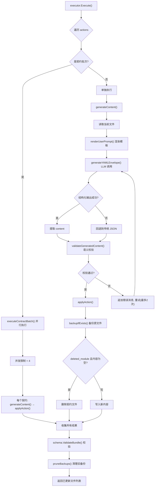

---

## 6. config 命令

`config` 命令管理全局 LLM 配置（`~/.kontext/config.yaml`），包含交互式配置和子命令操作。

**核心文件：** `cmd/config.go`、`cmd/config_tui.go`、`internal/config/config.go`

### 6.1 命令结构

```
kontext config            → 交互式配置向导
kontext config set <k> <v> → 设置配置项
kontext config get <k>     → 获取配置项
kontext config list        → 列出所有配置项
```

支持的配置项：`llm.base_url`、`llm.api_key`、`llm.model`、`llm.timeout`

### 6.2 交互式配置流程

**入口：** `runInteractiveConfig()` — `cmd/config.go:91`

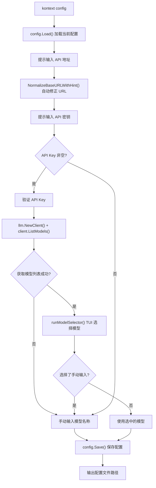

### 6.3 TUI 模型选择器

`runModelSelector()` 使用 Bubble Tea 框架提供交互式列表选择：

- 当前模型置顶并标记 `(当前)`
- 支持 `↑↓` 移动、`/` 搜索、`Enter` 确认、`Esc` 跳过
- 末尾提供「手动输入模型名称」选项
- 使用 Alt Screen 模式，退出后恢复终端

**核心文件：** `cmd/config_tui.go`

### 6.4 config set/get/list

- **set**：加载配置 → 更新对应字段（URL 自动修正，timeout 校验正整数） → 保存
- **get**：加载配置 → 输出对应字段值（timeout 为 0 时显示默认值）
- **list**：加载配置 → 逐项输出（api_key 脱敏显示，仅显示前4+后4位）

---

## 附录：核心文件索引

| 文件路径 | 职责 |
|---------|------|
| `cmd/root.go` | 根命令定义、日志初始化、子命令注册 |
| `cmd/init.go` | init 命令入口、flag 定义、模式分发 |
| `cmd/init_interactive.go` | 交互式/AI/静态初始化实现 |
| `cmd/init_scan.go` | Scan 模式 9 阶段流水线 |
| `cmd/init_helpers.go` | 进度条、文件列表、辅助函数 |
| `cmd/init_templates.go` | 静态初始化的默认模板内容 |
| `cmd/pack.go` | pack 命令入口、任务输入解析 |
| `cmd/validate.go` | validate 命令实现 |
| `cmd/update.go` | update 命令入口、进度 UI |
| `cmd/config.go` | config 命令及子命令实现 |
| `cmd/config_tui.go` | Bubble Tea 模型选择器 |
| `cmd/logging_helpers.go` | 日志辅助函数、命令路径常量 |
| `internal/generator/engine.go` | AI 交互式初始化引擎、LLM 调用封装 |
| `internal/packer/engine.go` | Pack 10 阶段流水线引擎 |
| `internal/packer/identifier.go` | LLM 文件识别（批量+校验） |
| `internal/packer/collector.go` | 候选上下文收集、文件内容预加载 |
| `internal/packer/matcher.go` | 关键词匹配模块契约 |
| `internal/packer/refiner.go` | LLM 二次精筛 |
| `internal/packer/builder.go` | 模板数据构建 |
| `internal/packer/namer.go` | LLM 语义文件名生成 |
| `internal/packer/prompt_template.go` | 提示词渲染 |
| `internal/updater/detector.go` | 变更检测（目录+契约+Manifest） |
| `internal/updater/planner.go` | 更新规划（优先级排序） |
| `internal/updater/executor.go` | 更新执行（LLM生成+备份+校验） |
| `internal/schema/loader.go` | Bundle 加载 + ValidateBundle |
| `internal/config/config.go` | 全局配置加载/保存 |
| `internal/llm/openai.go` | OpenAI 兼容 LLM 客户端 |
| `internal/cache/checkpoint.go` | Scan 检查点与缓存管理 |
